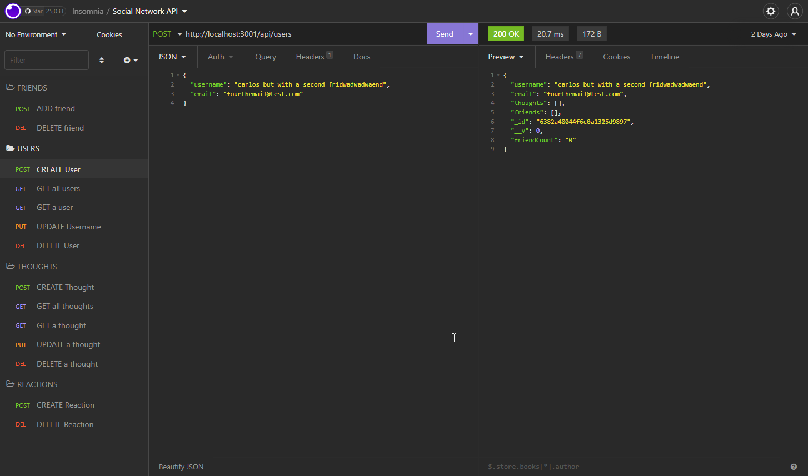

# Social-Network-API

## Description

This project was built to demonstrate what API routes would look like to manage a social media database using [MongoDB](https://www.mongodb.com/). To manage the MongoDB database I am making use of the [mongoose](https://www.npmjs.com/package/mongoose) node module that allows for schemas to be used for data formatting before going anywhere near the actual database. [Express](https://www.npmjs.com/package/express) is used as the web framework to create RESTful API routes to interact with the database from the front end.

https://user-images.githubusercontent.com/50060256/204421675-a7c52e93-eaf6-457c-bf7c-532bd51cf414.mp4

Express routes allow the user to get, create, update, and delete data from the MongoDB database. This is displayed below using Insomnia Core.




Shown below is the mongoose thought schema that is eventually used to make a thought model. The model made from the schema is responsible for creating and reading documents in the MongoDB database.

```js
const thoughtSchema = new mongoose.Schema(
    {
        thoughtText: {
            type: String,
            required: true,
            minlength: 1,
            maxlength: 280
        },
        createdAt: {
            type: Date,
            default: Date.now,
            get: formatDate
        },
        username: {
            type: String,
            required: true
        },
        reactions: [reactionSchema]
    }
);
```
## Technologies Used

- [Visual Studio Code](https://code.visualstudio.com/)
- [Github](https://github.com/)
- [Node JS](https://nodejs.org/dist/latest-v16.x/docs/api/)
- [Insomnia Core](https://insomnia.rest/products/insomnia)
- [express](https://www.npmjs.com/package/express)
- [mongoose](https://www.npmjs.com/package/mongoose)
- [MongoDB](https://www.mongodb.com/)
